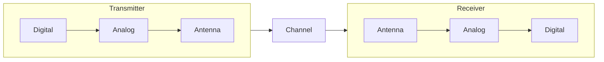

## RF Impairments Overview

In a wireless communication system, various factors can distort the received signal. When the distortion originates from the imperfections of analog components in the transceivers, it is referred to as RF impairment. Other causes include channel fading or synchronization issues. These impairments introduce interference and degrade the performance of wireless systems.

The ability to mitigate RF impairment is often a key measure of the quality of a radio product.

As shown in the diagram above, the analog circuit elements in the transmitter and receiver, due to their inherent imperfections, are responsible for RF impairments. Examples include gain or phase imbalances in direct conversion modulators and demodulators and nonlinearity in power amplifiers.

Before diving into details, let’s outline some common RF impairments:

- Thermal noise
- Amplifier distortion
- IQ imbalance
- DC offset
- Phase noise
- Carrier frequency offset (CFO)

## Thermal Noise, Noise Figure, and Sensitivity

We begin with the simplest RF impairment: **thermal noise**. Despite its simplicity, it is easy to overlook during technical discussions or interviews. Thermal noise arises from the thermal energy of the environment around the transceiver. Its power density is given by the equation:

$$
N_0 = kT
$$

where $k$ is the Boltzmann constant and $T$ is the temperature in Kelvin. At room temperature, the thermal noise power density is approximately -174 dBm/Hz.

### Noise Figure (NF)

When an analog signal passes through an RF device, noise is invariably added to the output. The **noise figure** quantifies the amount of noise a system introduces, representing the overall noise characteristics of a device. It is measured in dB (if written as F, it uses a linear scale). The relationship between input and output signal-to-noise ratio (SNR) is expressed as:

$$
\text{SNR}_\text{out} = \text{SNR}_\text{in} - \text{NF}
$$

The lower the noise figure, the better the device performance. Typically, noise figures are less than 10 dB, and in low-noise devices, such as low-noise amplifiers (LNA), it can be below 1 dB.

### Friis’s Formula

The **Friis formula** calculates the total noise factor of a cascade of stages, each with its own noise factor and power gain:

$$
F_{\text{total}} = F_1 + \frac{F_2 - 1}{G_1} + \frac{F_3 - 1}{G_1 G_2} + \dots + \frac{F_n - 1}{G_1 G_2 \dots G_{n-1}}
$$

A key insight is that the overall noise figure of a radio receiver is primarily determined by the noise figure of its first amplifying stage.

To measure a device’s noise figure, one can use a **noise figure meter**, though it is often expensive and has limitations. Alternatively, the **gain method** using a spectrum analyzer and calculations can be employed.

### Sensitivity

Sensitivity defines the minimum signal power required to achieve a specified bit error rate (BER). It can be calculated using the equation:

$$
S_{\text{min}} = -174 + 10\log(\text{BW}) + \text{NF}_{\text{rx}} + \text{CNR}_{\text{min}}
$$

Here:

- -174 dBm/Hz is the thermal noise power density.
- $\text{BW}$ is the signal bandwidth.
- $\text{NF}_{\text{rx}}$ is the receiver’s noise figure.
- $\text{CNR}_{\text{min}}$ is the minimum required carrier-to-noise ratio (different from SNR).

From this equation, the most effective way to improve sensitivity is to reduce the receiver’s noise figure.
